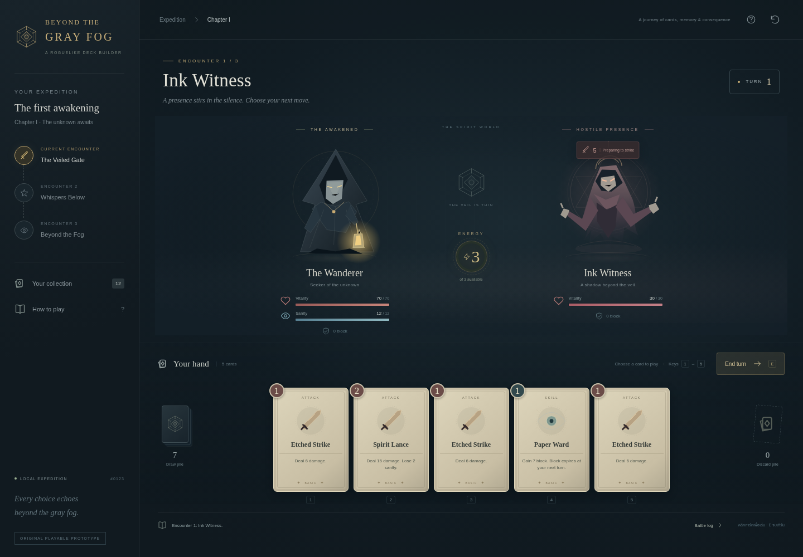

# Beyond the Gray Fog

ต้นแบบเกมเว็บแนว roguelike deckbuilding พร้อมเครื่องมือวิจัย APK/XAPK และฐานความรู้
ออฟไลน์สำหรับ Codex พัฒนาต่อใน repository เดียวกัน

**สถานะ:** กฎเกม ข้อความ และภาพในต้นแบบเป็นงานออกแบบใหม่ ได้รับ bootstrap pack
จาก Chaos Zero Nightmare แล้ว และอ่านโครงสร้าง UI ส่วนเปิดเกมได้ 18 ฉาก / 474 nodes
ได้รับ runtime ZIPs และถอดข้อความเกี่ยวกับการ์ด 4,725 รายการแล้ว range ZIP ใหม่
คืน card rows 278 รวม variants, effect parameters และ UI 5 ฉาก / 683 nodes
สูตรดาเมจและ complete combat HUD ยังไม่ยืนยัน ดู [card/battle analysis](docs/research/CHAOS_CARD_BATTLE_ANALYSIS.md)
เวอร์ชัน `1.0.811` ยืนยันจาก manifest แล้ว
แต่ยังไม่ยืนยันว่าเป็น release ล่าสุด
ดู [สถานะหลักฐาน](docs/EVIDENCE_STATUS.md)

แพ็กมีไฟล์ที่ตรวจ hash ครบ 162 ไฟล์ ยืนยันรูปแบบ Cocos Studio scene ได้ และสร้าง
wireframe ที่เลือกฉาก/ตรวจ node ได้โดยไม่รันเกม ดู [ผลวิเคราะห์ bootstrap](docs/research/CHAOS_BOOTSTRAP_ANALYSIS.md)
และ [วิธีเปิด wireframe บน Windows](docs/BOOTSTRAP_REPLAY.md)



[ภาพบนหน้าจอมือถือ](docs/images/prototype-mobile.png) · [ผลตรวจการทำงาน](docs/VALIDATION.md)

## เริ่มใช้งาน

ต้องมี Node >=22.12 และ <25 (ทดสอบด้วย 24.19.0), npm และ Python 3.12

```sh
npm ci
npm run dev
```

เซิร์ฟเวอร์ฟังที่พอร์ต 5173 สำหรับการตรวจภายในเครื่อง สภาพแวดล้อม onboarding
ไม่ได้รองรับลิงก์ preview ของ localhost ใช้ screenshot และ smoke test ตรวจ UI ได้
เกมใช้ไฟล์ในเครื่อง ไม่มี API key หรือ backend

```sh
npm test
npm run test:python
npm run build
npm run smoke
```

คำสั่งสุดท้ายต้องมี Chromium; กำหนด `CHROMIUM_BIN` หากติดตั้งไว้ที่อื่น

## เล่นต้นแบบ

เล่นการ์ดจากมือโดยใช้พลังงาน อ่านเจตนาศัตรูก่อนจบเทิร์น ใช้ block ลดความเสียหาย
และดูแลทั้ง HP กับ sanity ผ่านการต่อสู้สามห้องและเลือกการ์ดรางวัลเพื่อจบ run
เปิด Deck เพื่อดูชุดการ์ด และเริ่มใหม่ได้จากปุ่ม New run
กฎต้นแบบอยู่ที่ `src/game.js` การแสดงผลอยู่ที่ `src/main.js`

## อ่านไฟล์เกมอ้างอิง

```sh
python tools/analyze_apk.py /path/to/reference.xapk \
  --output /workspace/game-research/reference
```

ตรวจ `--help` ก่อนใช้ตัวเลือกเพิ่มเติม เครื่องมืออ่านแบบ static ไม่รันไฟล์เกม
รายงานระบุสิ่งที่เห็นจริงและสิ่งที่ยังสรุปไม่ได้ อ่านขั้นตอนรับไฟล์ใหญ่และข้อจำกัด
ที่ [APK analysis](docs/APK_ANALYSIS.md)

เมื่อมีรายงานแล้ว ใช้ [research pack](docs/RESEARCH_PACK.md) รวมเฉพาะ bootstrap
resources ให้เล็กกว่า 30 MiB พร้อม source hashes เพื่อส่งมาตรวจต่อโดยไม่ส่งทั้งเกม

ได้รับ native APK 21.92 MiB แล้ว ตรวจ libraries 10 ไฟล์ อ่าน PLPcK bootstrap
และ schema ของ TileSprite เพิ่มได้ ภายหลัง runtime resources คืนฐานข้อความ
อังกฤษ 108,306 รายการ ดู [ผล runtime research](docs/research/CHAOS_RUNTIME_ANALYSIS.md)
ดู [ผลตรวจ native](docs/research/CHAOS_NATIVE_ANALYSIS.md)

**ขั้นถัดไปเมื่อเกมอยู่ใน LDPlayer:** [ตรวจ resource ที่ดาวน์โหลดไว้](docs/LDPLAYER_RESOURCES.md)
เครื่องมือใช้ ADB บน Windows อ่านรายการชื่อ/ขนาดไฟล์ก่อนเลือกส่งมาตรวจ
ได้รับ inventory ผู้ใช้แล้ว: 47 files / 7.56 GiB เลือก manifest, ARM64 และ
English chunks 6 files สำหรับ [export สอง ZIP](docs/LDPLAYER_RESOURCES.md#export-resource-ที่เลือกจากรายงานนี้)
ZIPs ทั้งสองได้รับและผ่าน CRC/SHA แล้ว อ่าน manifest 87,529 paths และฐานข้อความ
อังกฤษได้ [range ZIP ชุดการ์ด/UI](docs/LDPLAYER_RESOURCES.md#ดึงค่าการ์ดและฉากต่อสู้เป็น-byte-ranges)
ได้รับแล้วและผ่าน decoded FHSH ครบ 18 resources ดู
[วิธีอ่าน DB และผัง UI ซ้ำ](docs/research/CHAOS_CARD_BATTLE_ANALYSIS.md)
อีกทางคือ [entry/config request](docs/SERVER_RESOURCES.md): ยืนยัน endpoint จาก
native แล้ว แต่ request ในคลาวด์ถูก proxy ปฏิเสธก่อนถึงเกมเซิร์ฟเวอร์

## ให้ Codex ใช้ lore แบบออฟไลน์

```sh
npm run lore:build
python tools/lore_index.py search --index .local/lore-index.json \
  --query "memory ritual" --limit 3
```

ตัวอย่างที่ให้มาเป็น lore ออกแบบใหม่ เพิ่มแหล่งเนื้อหาที่ใช้ได้ใน
`lore/sources.json` ก่อนอ้างว่าเป็นข้อเท็จจริงจาก LoTM หรือ Circle of Inevitability
อ่าน [วิธีใช้ Codex](docs/CODEX_WORKFLOW.md) และ [แหล่ง lore](docs/LORE_SOURCES.md)

## โครงสร้าง

```text
src/          เกมและ UI ที่เล่นได้
tests/        ทดสอบ engine และเครื่องมือวิจัย
tools/        อ่าน archive, ค้น lore, browser smoke test
lore/         ข้อมูลตัวอย่างพร้อม provenance
docs/         หลักฐาน ข้อจำกัด และขั้นตอนทำงาน
AGENTS.md     ข้อตกลงให้ Codex อ่านเมื่อเริ่มงาน
```

ไฟล์ต้นฉบับเกมอ้างอิงและผลวิจัยไม่ต้อง commit ลง repository
