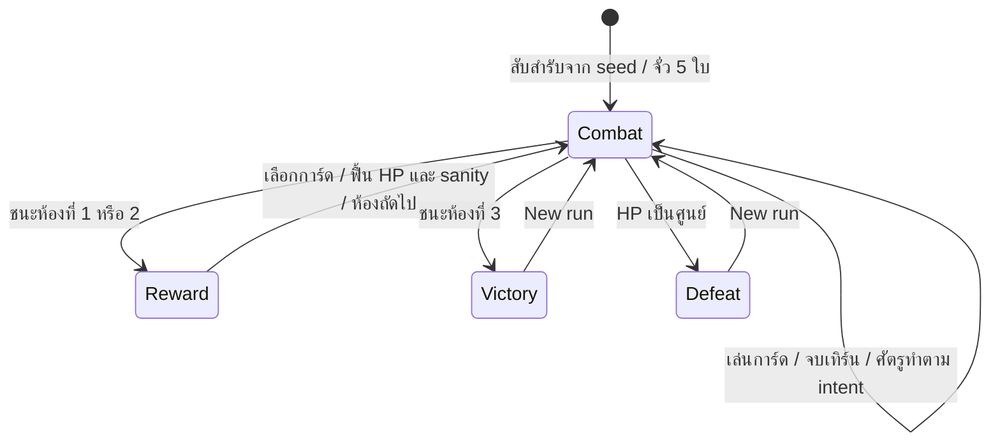

# แบบจำลองต้นแบบ: original design

เอกสารนี้อธิบายสิ่งที่ source code ของเราทำ ไม่ใช่ผล reverse engineering
Chaos Zero Nightmare และไม่ใช่ข้อเท็จจริง canon จากนิยาย

| สิ่งที่ผู้เล่นตัดสินใจ | ข้อมูลที่ UI ต้องแสดงก่อนตัดสินใจ |
|---|---|
| เล่นการ์ด | พลังงานที่ใช้ effect และต้นทุน sanity |
| จบเทิร์น | เจตนาศัตรู ความเสียหาย/การป้องกัน และ block ที่มี |
| เลือกรางวัล | effect ของแต่ละใบและประโยชน์ต่อสำรับปัจจุบัน |
| ใช้ sanity จนหมด | sanity เป็นศูนย์ทำให้เสีย 3 HP ตอนจบเทิร์นโดยไม่สน block |

ต้นแบบมีสำรับเริ่มต้น 12 ใบ พลังงาน 3 ต่อเทิร์น จั่ว 5 ใบ
block ของผู้เล่นหมดเมื่อเริ่มเทิร์นถัดไป การ์ดที่ exhaust หายเฉพาะการต่อสู้ปัจจุบัน
เลือกการ์ดรางวัลแล้วฟื้น 8 HP และ 3 sanity ศัตรูและลำดับห้องตั้งไว้สามตัว
การสับสำรับและชุดรางวัลขึ้นกับ seed

## ปรับเป็นธีม LoTM/CoI เมื่อมีแหล่งเนื้อหา

เริ่มจาก mapping สี่ชั้น: ข้อเท็จจริงจากแหล่ง → ธีม/ข้อจำกัดของโลก →
กฎที่ผู้เล่นเข้าใจได้ → การ์ด/หน้าจอที่ตรวจได้ เช่น ถ้าแหล่งที่ตรวจแล้วบอกว่า
ความสามารถมีต้นทุนหรือเงื่อนไข ให้ต้นแบบแสดงต้นทุนนั้นก่อนกดการ์ด
อย่าเปลี่ยนศัพท์นิยายเป็น stat โดยอัตโนมัติโดยไม่บันทึกเหตุผล

สิ่งที่ยังเป็นงานพัฒนาต่อ: route ที่เลือกได้, event/rest, ตัวละครหลายคน,
meta progression, save/load, lore ที่ยืนยันแล้ว, balance ระยะยาว
เพิ่มทีละระบบพร้อม acceptance criteria หลังมีข้อมูลอ้างอิงจริง
